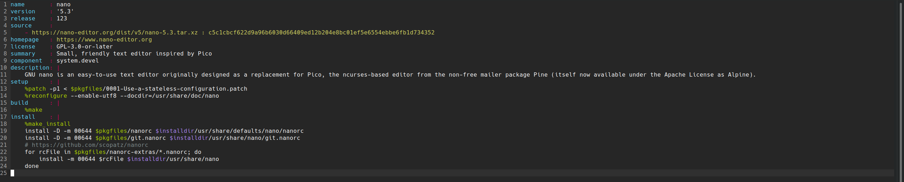

Syntax highlighting and colorscheme for [Micro Editor](https://github.com/zyedidia/micro)
- The syntax is made to work with the [package.yml](https://getsol.us/articles/packaging/package.yml/en/) for Solus which is used for build instructions.
- the colorscheme is based on the [default colorscheme](https://github.com/zyedidia/micro/blob/master/runtime/colorschemes/default.micro) of micro with changes to work fully with the package.yaml syntax.



# Installation

## Syntax

for syntax highlighting place the package.yaml in

`~/config/micro/syntax/`

or

`wget -P ~/.config/micro/syntax https://raw.githubusercontent.com/Girtablulu/micro-solus/master/package.yaml`

## Colorscheme

for colorscheme support place the solus.micro in

`~/.config/micro/colorschemes`

or

`wget -P ~/.config/micro/colorschemes https://raw.githubusercontent.com/Girtablulu/micro-solus/master/solus.micro`

to use the colorscheme you have to add inside `~/config/micro/settings.json`

```
{
    "colorscheme": "solus"
}
```

